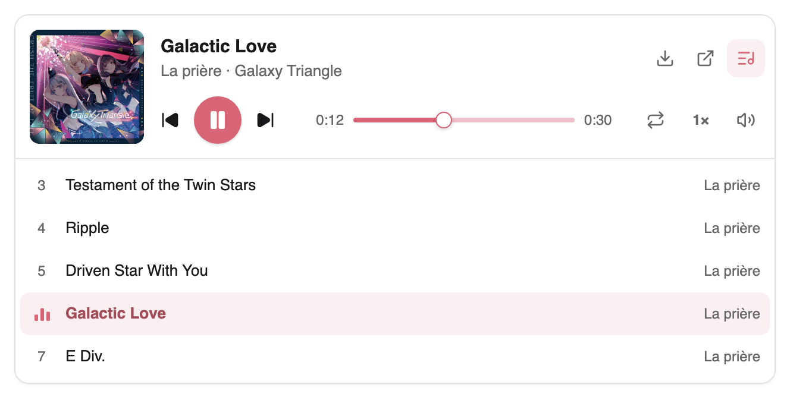
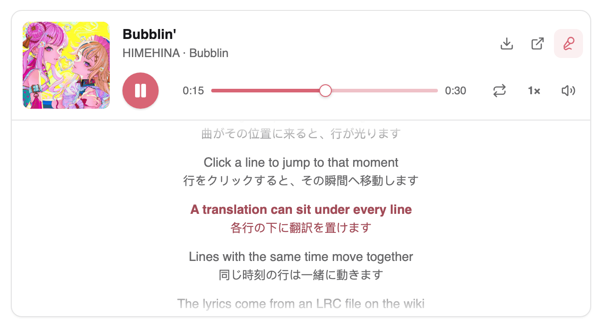
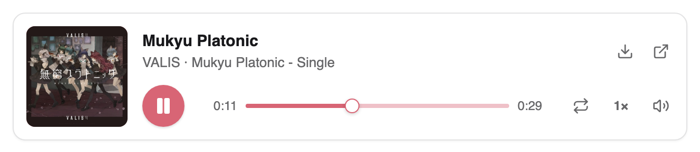
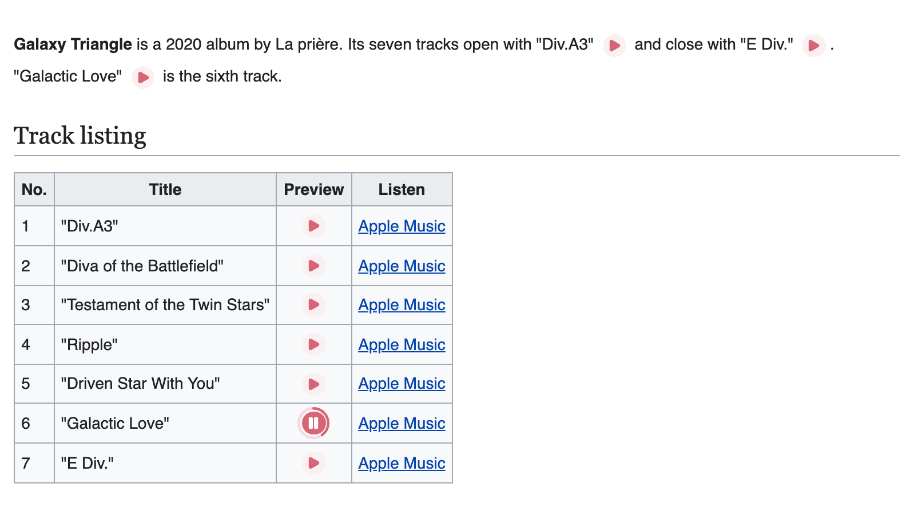
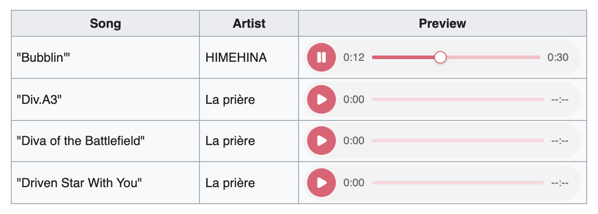
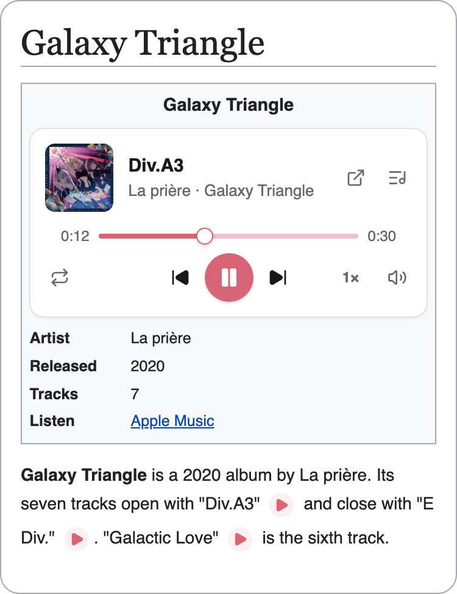
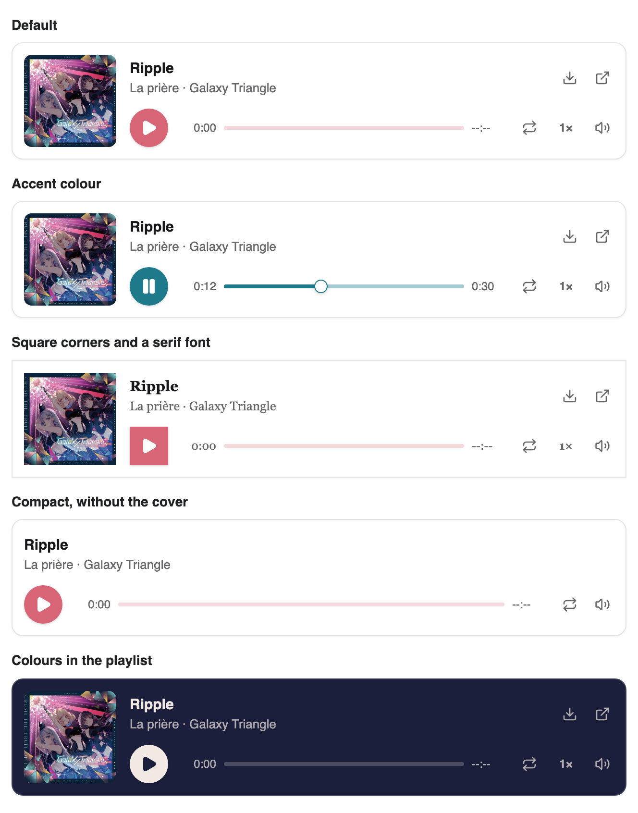

# Gramophone

Gramophone 是一个可在维基页面上播放音乐的 MediaWiki 扩展。它可以在一个播放器中呈现整张专辑，
并显示封面和曲目列表，也可以显示随歌曲播放而高亮的歌词，还能在句子和表格中添加小巧的播放按钮。

[English README](README.md)

正在使用 Sm2Shim、FlashMP3 或 AudioButton？Gramophone 也支持它们的标签，无须修改现有页面即可继续使用。
请参阅[从 Sm2Shim、FlashMP3 或 AudioButton 迁移](#从-sm2shimflashmp3-或-audiobutton-迁移)。

<picture>
  <source media="(prefers-color-scheme: dark)" srcset="docs/screenshots/album-dark.png">
  
</picture>

## 功能

- 播放列表可显示封面、标题、艺术家和专辑，并提供循环播放、播放速度和音量控件。
- 从 LRC 文件读取同步歌词，可附带翻译行。点击歌词即可跳转到对应位置。
- 在文本和表格单元格中插入带进度环的行内播放按钮。一个按钮可以依次播放多个文件。
- 表格单元格中的单首曲目使用单行播放器，手机和信息框使用窄版布局。
- 支持维基上传的音频、Commons 等共享文件库中的音频，以及其他网站的音频，可选择限制允许的网站。
- 只有读者按下播放按钮后才加载音频。播放器在滚动进入视野时才初始化。
- 支持键盘、屏幕阅读器、深色模式和系统媒体控件（锁屏、媒体按键）。禁用 JavaScript 时，页面显示普通音频链接。
- 可通过 CSS 自定义属性和 `::part()` 规则为整个维基或单个播放器设置样式。请参阅[更改外观](#更改外观)。
- 无须 Composer、数据库表、ffmpeg 或作业队列。
- 兼容 Sm2Shim、FlashMP3 和 AudioButton 的标签。

## 效果展示

同步歌词，每行下方附有翻译：

<picture>
  <source media="(prefers-color-scheme: dark)" srcset="docs/screenshots/lyrics-dark.png">
  
</picture>

单首歌曲：

<picture>
  <source media="(prefers-color-scheme: dark)" srcset="docs/screenshots/single-dark.png">
  
</picture>

句子和曲目列表中的播放按钮。圆环表示歌曲的播放进度：

<picture>
  <source media="(prefers-color-scheme: dark)" srcset="docs/screenshots/buttons-dark.png">
  
</picture>

表格单元格中的单首歌曲使用单行播放器：

<picture>
  <source media="(prefers-color-scheme: dark)" srcset="docs/screenshots/track-list-dark.png">
  
</picture>

在手机或信息框等较窄的容器中，播放器会采用更窄的布局：

<picture>
  <source media="(prefers-color-scheme: dark)" srcset="docs/screenshots/phone-dark.png">
  
</picture>

这些图片来自 `client/demo/` 中的演示页面。音乐为 La prière 的《Galaxy Triangle》、
HIMEHINA 的《Bubblin'》和 VALIS 的《Mukyu Platonic》。演示播放它们在 Apple Music 上的
30 秒试听片段并显示封面，相关版权属于艺术家及其唱片公司。音频和封面文件在运行演示时下载，
不包含在本仓库中。演示中的歌词用于介绍播放器，并非歌曲的真实歌词。

## Gramophone 还是 TimedMediaHandler？

[TimedMediaHandler](https://www.mediawiki.org/wiki/Extension:TimedMediaHandler) 是维基百科和
Wikimedia Commons 使用的媒体扩展。它播放上传的音频和视频文件，页面像嵌入图片一样嵌入这些文件，
例如 `[[File:Song.ogg]]`。对于视频，或需要将每个文件转换为所有浏览器都能播放的格式的维基，
它是更合适的选择。

Gramophone 专为音乐和声音相关页面设计，例如专辑与歌曲条目、游戏原声与语音台词，以及附带发音的语言页面。

| | Gramophone | TimedMediaHandler |
| --- | --- | --- |
| 添加音频的方式 | `<gramophone>` 和 `<playbutton>` 标签 | `[[File:Song.ogg]]`，与图片相同 |
| 专辑和播放列表 | 一个播放器，带曲目列表和封面 | 每个文件一个播放器 |
| 歌词 | 在播放器内滚动的同步歌词（LRC 文件），支持翻译 | TimedText 页面上的字幕（WebVTT 或 SRT）。带字幕的音频在弹出播放器中打开。 |
| 文本和表格中的播放按钮 | 带进度环的小圆形按钮，每个按钮支持多个文件 | 小型文件播放器（`[[File:A.ogg\|40px]]`） |
| 其他网站的音频 | 支持，可选择限制允许的网站 | 不支持，仅支持维基文件，也可来自 Commons 等共享文件库 |
| 视频 | 不支持 | 支持 |
| 浏览器无法播放的格式，例如 MIDI | 按上传的原文件播放，因此请将这类音频以 MP3 格式上传 | 由 ffmpeg 转换，MIDI 渲染为音频 |
| 编辑 | 以文本形式编辑标签 | 通过 VisualEditor 的媒体对话框插入，与图片相同 |
| 服务器配置 | 仅需 `wfLoadExtension` | Composer、`update.php`，以及 ffmpeg 和作业执行程序 |
| MediaWiki 版本 | 同一版本适用于 1.43 及更新版本 | 每个 MediaWiki 版本对应一个分支 |

**可以同时使用两者。** 它们互不干扰：`[[File:Song.mp3]]` 显示 TimedMediaHandler 的播放器，
`<gramophone>Song.mp3</gramophone>` 则使用 Gramophone 的播放器播放同一文件。
Gramophone 始终播放上传的原文件，不会使用 TimedMediaHandler 转换后的副本。

## 安装

需要 MediaWiki 1.43 或更新版本（已在 1.43、1.45 和 1.46 上测试）以及 PHP 8.1 或更新版本。

1. 将扩展克隆到 `extensions/Gramophone`：

   ```sh
   git clone https://github.com/Laoweek/mediawiki-extensions-Gramophone.git extensions/Gramophone
   ```

2. 在 `LocalSettings.php` 中添加：

   ```php
   wfLoadExtension( 'Gramophone' );
   ```

3. 如需上传音频和歌词，请允许相应的文件类型。MediaWiki 默认仅允许图片：

   ```php
   $wgFileExtensions[] = 'mp3';
   $wgFileExtensions[] = 'lrc';
   ```

4. 打开 Special:Version，确认列表中包含 Gramophone。

克隆的文件还包含 `client/`、`dev/` 和 `.git/`，其中有演示页面、脚本和测试维基的配置。
读者不需要访问这些内容，请禁止通过网页访问它们。

<details>
<summary>禁止访问开发目录的服务器规则</summary>

Apache：在服务器配置中添加以下规则（如果 `AllowOverride` 包含 `FileInfo`，也可以放在 `.htaccess` 中）：

```apache
RedirectMatch 404 /extensions/Gramophone/(\.git|client|dev)(/|$)
```

nginx：将规则放在 `server` 块内其他 `location ~` 块之前。如果某个 `location ^~` 块
涵盖了 `extensions/` 目录，则应将规则放在该块内：

```nginx
location ~ /extensions/Gramophone/(\.git|client|dev)(/|$) {
    deny all;
}
```

</details>

<details>
<summary>不使用 git 安装</summary>

下载最新的 `main` 并解压到 `extensions/Gramophone`。此下载包不包含开发目录：

```sh
mkdir extensions/Gramophone
curl -fsSL https://github.com/Laoweek/mediawiki-extensions-Gramophone/archive/refs/heads/main.tar.gz \
    | tar -xz --strip-components=1 -C extensions/Gramophone
```

</details>

## 使用方法

Gramophone 提供两个标签：

- `<gramophone>` 在页面上放置音乐播放器。
- `<playbutton>` 在句子或表格单元格中放置小巧的播放按钮。

两者都接受维基文件名（可带或不带 `File:` 前缀）或音频文件的网址。

旧标签 `<flashmp3>`、`<sm2>` 和 `<modernsoundmanager>`（来自 Sm2Shim 和 FlashMP3）仍然可用，
并显示相同的播放器。`<ab>`（来自 AudioButton）在启用一项设置后也可使用。
新页面可以使用上面的两个标签。

### 单首歌曲

```wikitext
<gramophone>Mukyu Platonic.mp3</gramophone>
```

播放器默认以文件名作为标题。如需显示实际标题、艺术家和封面，请将歌曲写成一个简短的 JSON 播放列表：

```wikitext
<gramophone>
{
  "playlist": [
    {
      "audioFileUrl": "Mukyu Platonic.mp3",
      "title": "Mukyu Platonic",
      "artist": "VALIS",
      "coverImageUrl": "Mukyu Platonic cover.jpg"
    }
  ]
}
</gramophone>
```

### 整张专辑

每首歌曲添加一个条目。`"isPlaylistOpen": true` 可在页面打开时显示曲目列表：

```wikitext
<gramophone>
{
  "isPlaylistOpen": true,
  "playlist": [
    { "audioFileUrl": "Div.A3.mp3", "title": "Div.A3", "artist": "La prière", "album": "Galaxy Triangle", "coverImageUrl": "Galaxy Triangle cover.jpg" },
    { "audioFileUrl": "Diva of the Battlefield.mp3", "title": "Diva of the Battlefield", "artist": "La prière", "album": "Galaxy Triangle", "coverImageUrl": "Galaxy Triangle cover.jpg" },
    { "audioFileUrl": "Galactic Love.mp3", "title": "Galactic Love", "artist": "La prière", "album": "Galaxy Triangle", "coverImageUrl": "Galaxy Triangle cover.jpg" }
  ]
}
</gramophone>
```

如需快速创建不含详细信息的列表，用逗号分隔文件即可：

```wikitext
<gramophone>Div.A3.mp3, Diva of the Battlefield.mp3, Galactic Love.mp3</gramophone>
```

### 歌词

将歌词上传为 [LRC 文件](https://en.wikipedia.org/wiki/LRC_(file_format))。
这是一种文本文件，每行以该行歌词的演唱时间开头。然后为歌曲指定该文件：

```wikitext
<gramophone>
{
  "playlist": [
    {
      "audioFileUrl": "Bubblin.mp3",
      "title": "Bubblin'",
      "artist": "HIMEHINA",
      "coverImageUrl": "Bubblin cover.jpg",
      "lrcFileUrl": "Bubblin.lrc"
    }
  ]
}
</gramophone>
```

翻译放在下一行，并使用相同的时间：

```
[00:11.00]Click a line to jump to that moment
[00:11.00]行をクリックすると、その瞬間へ移動します
```

播放器会显示歌词按钮。如果歌词提前或延后，请在歌曲中添加 `"lrcFileOffset": 500`（单位为毫秒）。

### 播放按钮

```wikitext
The album opens with Div.A3 <playbutton>Div.A3.mp3</playbutton> and ends with E Div. <playbutton>E Div.mp3</playbutton>

{| class="wikitable"
! # !! Song !! Preview
|-
| 1 || Div.A3 || <playbutton title="Div.A3">Div.A3.mp3</playbutton>
|-
| 2 || Diva of the Battlefield || <playbutton title="Diva of the Battlefield">Diva of the Battlefield.mp3</playbutton>
|}
```

- `title` 指定按钮名称，用于工具提示、屏幕阅读器和锁屏。
- 用逗号分隔多个文件时，一个按钮会依次播放这些文件。
- `hidemissing="yes"` 在文件不存在时隐藏按钮。适合为每行添加按钮、但部分录音可能缺失的模板。

### 在模板中使用

将选项写成属性，或使用 `#tag` 传入模板参数：

```wikitext
<playbutton title="Greeting" hidemissing="yes">Greeting.mp3</playbutton>
{{#tag:playbutton|{{{file}}}|title={{{name}}}|hidemissing=yes}}
```

在 `#tag` 中使用 JSON 播放列表时，请用 `<nowiki>` 包裹 JSON，以免其中的 `}}` 提前结束 `#tag`。

### 其他网站的音频

可以用网址替代文件名：

```wikitext
<gramophone>https://audio.example.org/songs/mukyu-platonic.mp3</gramophone>
```

除非你的设置允许更多操作，否则读者的浏览器只有在读者按下播放按钮后才会连接该网站。
如需只允许特定网站，请参阅[设置](#设置)。

### 选项

| 使用位置 | 选项 | 作用 |
| --- | --- | --- |
| `<gramophone>` | `loop=yes`，或 JSON 中的 `"loop": true` | 循环播放列表 |
| `<gramophone>` | `openplaylist=yes`，或 `"isPlaylistOpen": true` | 在页面打开时显示曲目列表 |
| `<gramophone>` | `autostart=yes`，或 `"autoPlay": true` | 尝试立即开始播放。浏览器通常会阻止自动播放，此时播放器会等待读者按下播放按钮。 |
| `<playbutton>` | `title=` | 按钮名称 |
| `<playbutton>` | `hidemissing=yes` | 文件缺失时隐藏按钮 |
| 两者 | `class` 和 `style` 属性 | 为这个播放器设置样式，参阅[更改外观](#更改外观) |

使用文件列表时，选项放在文件名后的 `|` 后面，例如 `<gramophone>Ripple.mp3|loop=yes</gramophone>`，
也可以写成属性，例如 `<gramophone loop="yes">Ripple.mp3</gramophone>`。
使用 JSON 播放列表时，请将选项放在 JSON 中，除 `class` 和 `style` 外的属性都会被忽略。

JSON 播放列表中的歌曲字段：

| 字段 | 含义 |
| --- | --- |
| `audioFileUrl` | 必填。音频的维基文件名或网址。 |
| `title`、`artist`、`album` | 显示在播放器和锁屏中。没有标题时显示文件名。 |
| `coverImageUrl` | 封面图片的维基文件名或网址。 |
| `lrcFileUrl` | 歌词 LRC 文件的维基文件名或网址。 |
| `lrcFileOffset` | 加到每个歌词时间上的毫秒数。 |
| `navigationUrl` | 歌曲链接到的页面或网址。默认情况下，维基文件链接到其文件页面。 |
| `isExplicit` | 设为 `true` 时显示露骨内容标识。 |

[docs/reference.md](docs/reference.md) 说明了各个标签、选项和字段的详细规则。

## 设置

所有设置都是可选的。将它们放在 `LocalSettings.php` 中的 `wfLoadExtension( 'Gramophone' );` 之后。

| 设置 | 默认值 | 作用 |
| --- | --- | --- |
| `$wgGramophoneAllowedHosts` | `null` | 允许提供音频、封面和歌词的其他网站，例如 `[ 'audio.example.org' ]`。`null` 表示允许所有网站。 |
| `$wgGramophoneSm2ShimTags` | `true` | 同时注册 Sm2Shim 和 FlashMP3 的 `<flashmp3>`、`<sm2>` 和 `<modernsoundmanager>` 标签。 |
| `$wgGramophoneAudioButtonTag` | `false` | 同时注册 AudioButton 的 `<ab>` 标签。 |
| `$wgGramophoneLegacyColors` | `false` | 应用旧页面中 Flash 时代的颜色选项（如 `bg=`）。 |

**隐私。** 读者按下播放按钮时，音频所在的网站会收到读者的 IP 地址。
默认情况下，在点击之前不会加载其他网站的任何内容：外站封面不会显示，自动播放也会等待。
[docs/configuration.md](docs/configuration.md) 说明如何允许更多行为，同时介绍上传和内容安全策略（Content Security Policy）。

## 从 Sm2Shim、FlashMP3 或 AudioButton 迁移

将原来的 `wfLoadExtension` 行替换为 `wfLoadExtension( 'Gramophone' );`。
使用旧标签编写的页面无须修改即可继续使用：

| 旧标签 | 对应行为 |
| --- | --- |
| `<flashmp3>` | 使用文件列表的 `<gramophone>` |
| `<sm2>` | `<playbutton>` |
| `<modernsoundmanager>` | 使用 JSON 播放列表的 `<gramophone>` |
| `<ab>` | 设置 `$wgGramophoneAudioButtonTag = true;` 后，对应 `<playbutton>` |

[docs/migrating.md](docs/migrating.md) 列出了迁移步骤和细微差异，例如默认忽略旧的 Flash 时代颜色设置，
除非你重新启用它们。

## 更改外观

播放器会自动适配维基的主题，包括深色模式，无须配置。如需自定义外观，可以使用 CSS：

- **自定义属性**，例如 `--gramophone-primary`（强调色）、`--gramophone-radius` 和
  `--gramophone-font-family`。在 MediaWiki:Common.css 中设置可应用于所有播放器，
  在标签的 `style` 属性中设置则只应用于单个播放器。
- **`::part()` 规则**，在 MediaWiki:Common.css 中重新设置播放器某个部分的样式，
  或将其隐藏，例如封面或下载按钮。
- **JSON 播放列表中的颜色**，为单个播放器设置配色。

同一首歌曲的五种外观：

<picture>
  <source media="(prefers-color-scheme: dark)" srcset="docs/screenshots/styles-dark.png">
  
</picture>

**强调色。** 为单个播放器设置时，使用 `style` 属性：

```wikitext
<gramophone style="--gramophone-primary: #1f7a8c">Ripple.mp3</gramophone>
```

如需应用于维基上的所有播放器，将以下内容添加到 MediaWiki:Common.css：

```css
.ext-gramophone {
	--gramophone-primary: #1f7a8c;
}
```

**直角和衬线字体。** 给标签添加一个类，例如 `<gramophone class="square">Ripple.mp3</gramophone>`，
然后在 MediaWiki:Common.css 中为该类设置样式：

```css
.ext-gramophone.square {
	--gramophone-radius: 0px;
	--gramophone-shadow: none;
	--gramophone-font-family: Georgia, serif;
}
.ext-gramophone.square::part(play-button) {
	border-radius: 0;
}
```

**无封面的紧凑布局。** 对于 `<gramophone class="compact">`：

```css
.ext-gramophone.compact::part(cover),
.ext-gramophone.compact::part(download-button),
.ext-gramophone.compact::part(file-page-button),
.ext-gramophone.compact::part(speed-button) {
	display: none;
}
.ext-gramophone.compact::part(bar) {
	grid-template-columns: minmax(0, 1fr);
	grid-template-areas: "meta" "ctrl";
}
```

**播放列表中的颜色。** 这些颜色同时适用于浅色和深色模式，播放器会调整其他色调以保证文字清晰可读：

```wikitext
<gramophone>
{
  "backgroundColor": "#1b1f3b",
  "foregroundColor": "#f2e9e4",
  "playlist": [
    { "audioFileUrl": "Ripple.mp3", "title": "Ripple", "artist": "La prière" }
  ]
}
</gramophone>
```

[docs/theming.md](docs/theming.md) 列出了所有属性和部件，并说明对 TemplateStyles 的支持。

## 更新

拉取最新的 `main`：

```sh
git -C extensions/Gramophone pull
```

不使用 git 时，删除 `extensions/Gramophone`，然后按照[安装](#安装)中的说明重新下载 `main`。

每项更改在合入 `main` 前都会经过测试。Gramophone 没有数据库表，因此不需要运行 `update.php`。
如果某项更改会改变现有维基文本的显示结果，或重命名样式接口中的某个部分，提交信息中会注明。
页面重新解析后才会显示这些变化：可以清除页面缓存，或设置 `$wgCacheEpoch` 来刷新所有页面。

安全修复通过 [GitHub 安全公告](https://github.com/Laoweek/mediawiki-extensions-Gramophone/security/advisories)发布。
如需接收通知，请在仓库页面选择 **Watch**，然后选择 **Custom**，勾选 **Security alerts**。

## 浏览器支持

Gramophone 面向电脑和手机上的当前版本 Chrome、Edge、Firefox 和 Safari。
已在 Google Chrome 中使用 Vector、Citizen 和 Minerva 皮肤进行测试。
较早版本也在 Safari 的浏览器引擎 WebKit 中测试过。Firefox 尚未测试，欢迎反馈。

禁用 JavaScript 或浏览器无法运行播放器时，页面会显示普通的音频文件链接。

## 文档

- [docs/reference.md](docs/reference.md)：各个标签、选项和字段的详细说明
- [docs/configuration.md](docs/configuration.md)：设置、外站音频、上传、内容安全策略、追踪分类
- [docs/theming.md](docs/theming.md)：颜色、尺寸、部件和 TemplateStyles
- [docs/migrating.md](docs/migrating.md)：从 Sm2Shim、FlashMP3、AudioButton 或 Piran Symphony Orchestra 迁移
- [CONTRIBUTING.md](CONTRIBUTING.md)：代码结构、如何运行检查和本地测试维基

## 许可证

MIT。请参阅 [LICENSE](LICENSE)。

播放器的图标来自 [Lucide](https://lucide.dev)（ISC 许可证，部分内容源自采用 MIT 许可证的 Feather）。
完整的版权和许可声明位于 `resources/dist/gramophone.js` 和 `resources/dist/gramophone.player.js` 的开头。
